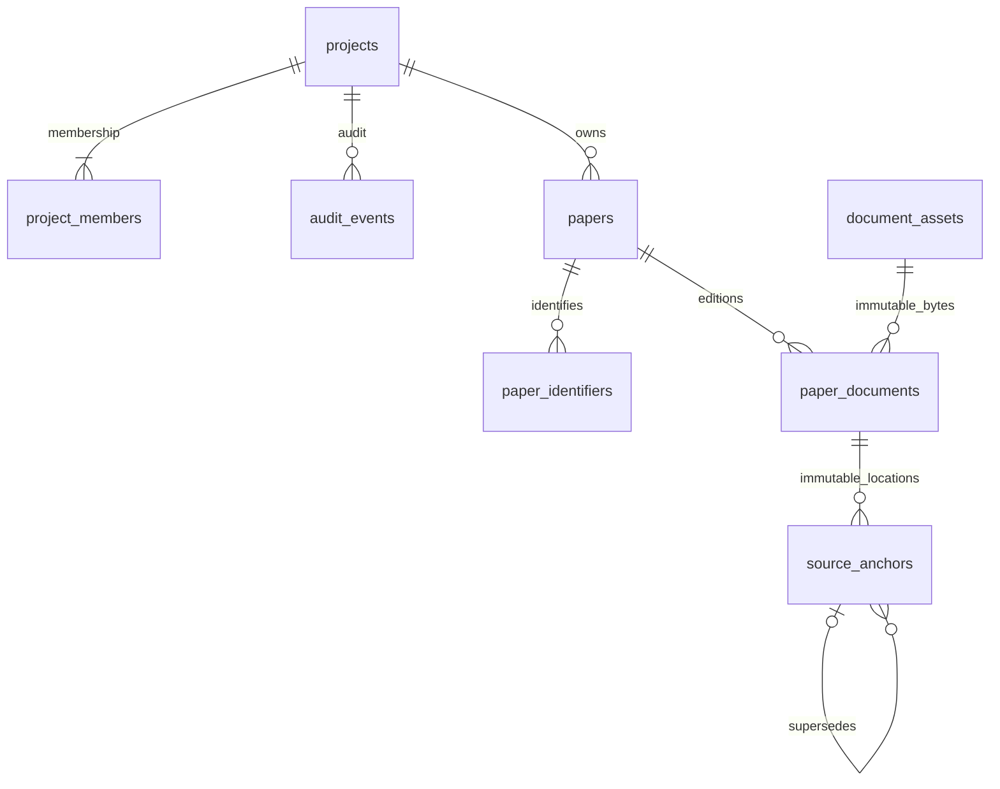
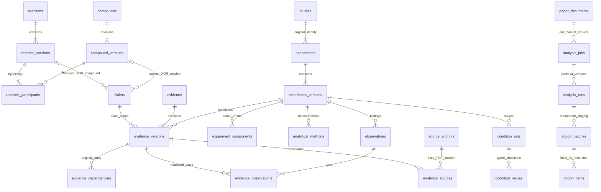

# Logical ERD v0.1

Only the eight tables in the first diagram are physically created in Phase 1. Every research relationship is project-scoped. Arrows do not imply cascade deletion.

C2 core contract (not migration tables yet):

Experimentless proposals reference explicitly reported applicability condition sets, never invented experiments. C2 comparisons preserve both supporting and refuting evidence and their condition comparability. Current pointers and supersedes edges must be constrained to the same tenant and stable entity. RQ typed joins, material samples, provider history and deferred tables are listed in the data dictionary.
